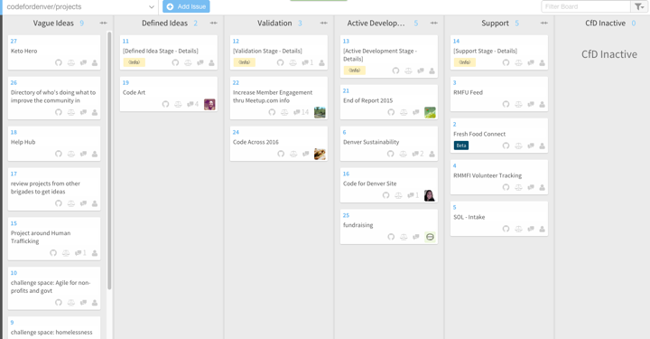
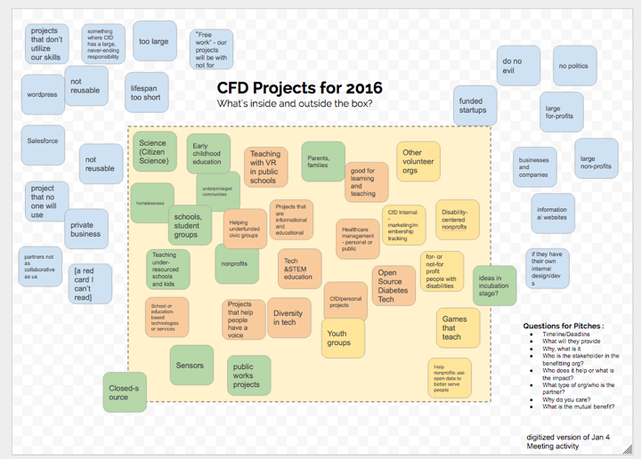

# Project process

> This document outlines the process for **pitching and guiding a project** through the Code for Denver project process. If you would like to know why, check out the [Readme](README.md).

Contents:
- Process Overview
- Project Stages
  - Vague Ideas
    - Submitting a New Project Idea
  - Defined Ideas
    - Pitching a Project to Code for Denver
  - Validation
    - Making Sure the Project is Worth Working On
  - Active Development
  - Support
  - Code for Denver Inactive

## Process Overview

There are 6 possible states for a project (these states can be seen as columns on the Waffle board):
- **Vague Ideas** (easy to put up on Waffle, no requirements except title)
- **Defined Ideas** (easy criteria, vote at C4D)
- **Validated Projects** (some more rigorous criteria)
- **Active Development** (assignment of resources and agreement of timeline)
- **Shepherd** (“maintenance”/handoff)
- **CfD inactive**

There are exit criteria for each stage, and not all projects will go through all the stages.

[](https://waffle.io/codefordenver/projects)

Additionally, projects can be identified with a particular [Code for America stage](http://www.codeforamerica.org/brigade/projects/stages) to be searchable as part of Code for America's larger network. These are stages are independent of the waffle state of the project.

____

## Project Stages

### Vague Ideas
#### Submitting a New Project Idea
Anyone can submit any idea to the waffle board to start the discussion around that idea. This can be submitted as an issue on either this github repository, or on the associated waffle board (which is built on those same issues).

### Defined Ideas
In order to move into a state of `Defined Idea`, the following must be completed
- Pitched at Code for Denver
- Recorded in Google docs
- Seemingly Valid based on our criteria for projects we will consider working on
- Passes "fist of 5" test that the project aligns with our values (below follows examples of what may fit)



#### Pitching a Project to Code for Denver

In order to get a project pitched at Code for Denver, the waffle card should fill out the following template, which can be presented on the first Monday of a Month meeting.

```
## Why
[Why is this project important]

## Who
[Who is the project targeted at benefiting]

## Why CfD
[Why is this a good fit for Code for Denver with our skills and values]

## Champion
[Is there a person willing to champion this project, and if so who?]

## Deadlines
[Are there any known deadlines, and what is the estimated amount of time the project would take]

## Potential Partner
[Who are potential partner organizations that would be willing to collaborate on this work?
Is there a partner representative identified, and if so, who?]
```

### Validation
If Code for Denver has enough resources to available to pull a project into validation without negatively affecting the current projects, a `Defined Idea` can be pulled into `Validation` if there is a champion and there are no objections from the group.

#### Making Sure the Project is Worth Working On

The goal of the validation phase is to investigate a series of questions that will determine if the project is worth devoting more resources from the group towards.

These questions are the following:
- Has this already been done?
- Is it something that is actually valuable?
- Do we have the expertise in the room?
- Is it doable in a reasonable time for us?
- Is there a willing partner?

[**Use this site**](https://cfd-new.herokuapp.com/) to create repo for the project, and a pre-populated waffle board to guide you through the process of validation.


### Active Development

Active development is the phase where Code for Denver commits more energy and effort into developing the solution.

This stage has the following requirements:

- Satisfactory answers to the validation questions
- Capacity of the group to work on the project (WIP of ~3)
- Champion
- Product Owner (could be same person as Champion)
- Tech Lead (if applicable)
- Partner
- Developers / people implementing the project
- Some form of analytics / feedback
- Users

### Support

Requirements:
- Someone owning responsibility for maintaining uptime
- Someone owning responsibility for addressing security concerns
- Someone to check criteria for ‘Done’
- Someone to maintain documentation


### Code for Denver Inactive
