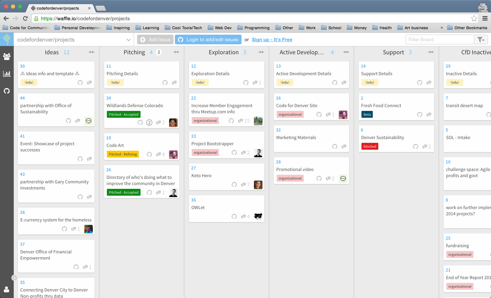

# Code for Denver Projects
Tracking Code for Denver's projects

This is a Waffle.io Kanban board for tracking projects we are working on. It can be found at: https://waffle.io/codefordenver/projects

## Why
In the several years that Code for Denver has existed, we have adapted our process several times in order to work towards creating the greatest impact in the community. This is our current working process based on what we have learned from experience over the last few years, and discussions with other Code for America Brigades.

Please read our [Contributing guidelines](CONTRIBUTING.md) to understand how the process works.
